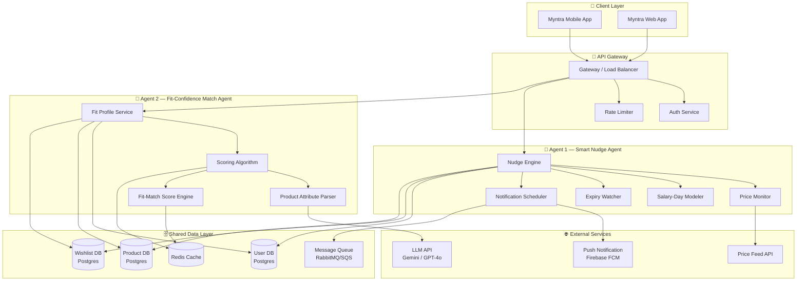
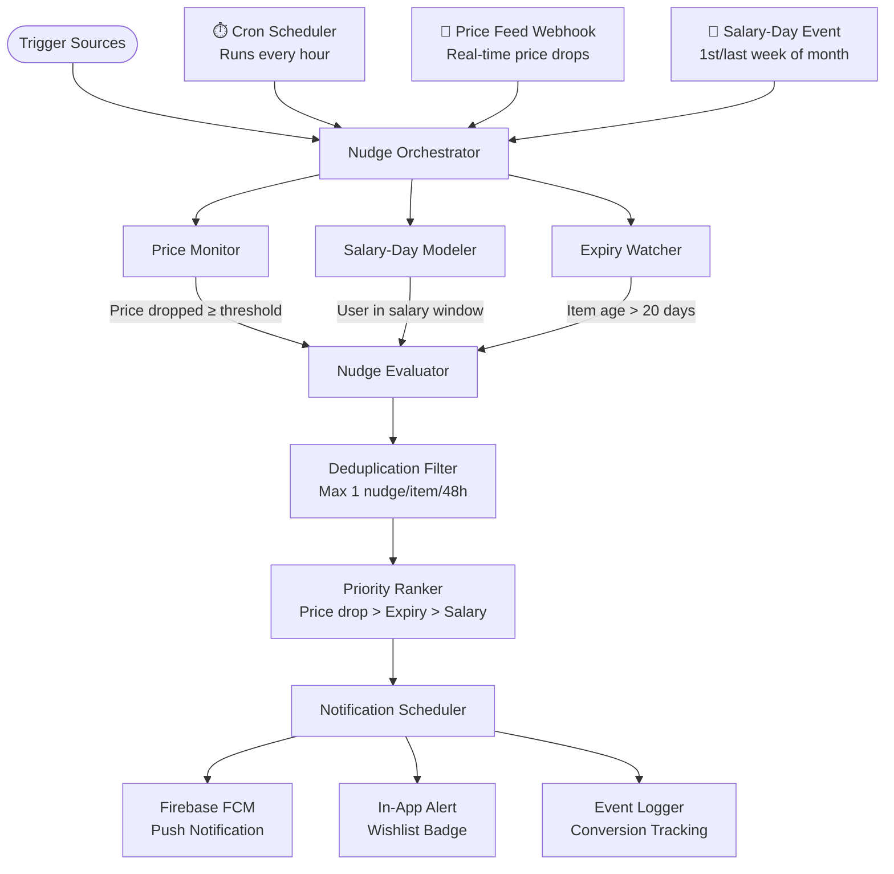
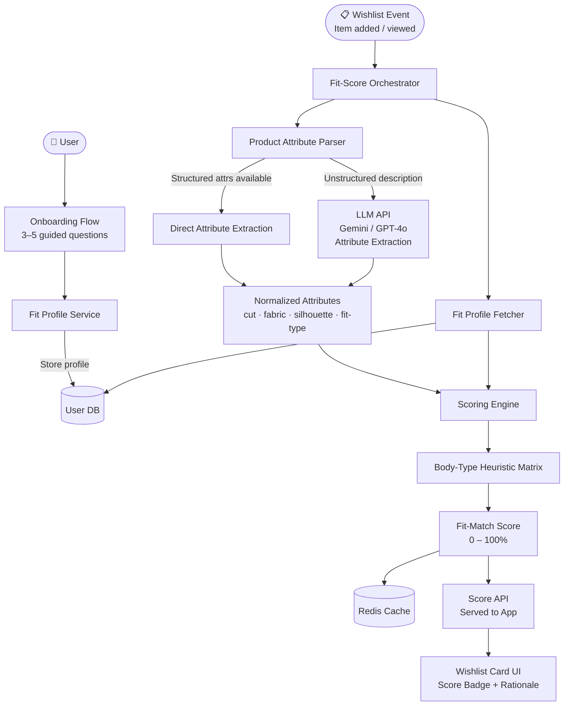
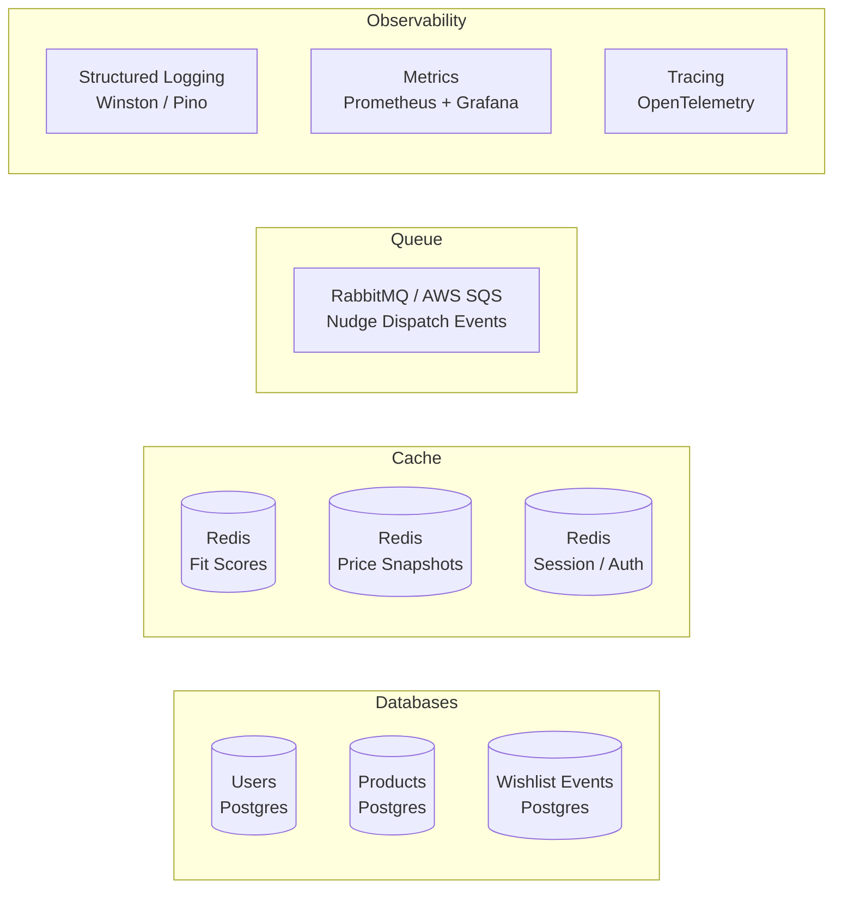
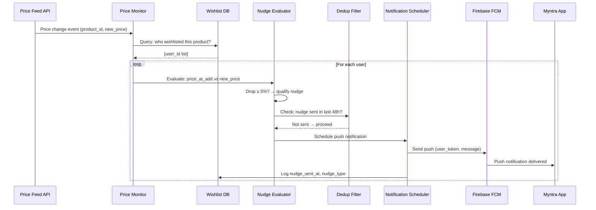
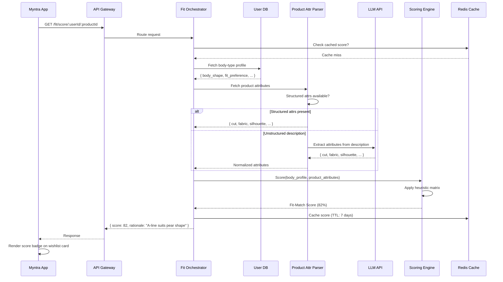

# 🏗️ Architecture — Myntra Wishlist-to-Purchase Conversion

> **Project:** Myntra AI Agent — Dual-Agent Wishlist Conversion System  
> **Scope:** Smart Nudge Agent (Timing) + Fit-Confidence Match Agent (Body-Type / Style Fit)  
> **Goal:** Convert high-intent wishlisted demand into purchases by eliminating the two root-cause blockers — timing uncertainty and fit-confidence uncertainty.

---

## 📋 Table of Contents

1. [High-Level System Overview](#1-high-level-system-overview)
2. [System Architecture Diagram](#2-system-architecture-diagram)
3. [Component Breakdown](#3-component-breakdown)
4. [Agent 1 — Smart Nudge Agent Architecture](#4-agent-1--smart-nudge-agent-architecture)
5. [Agent 2 — Fit-Confidence Match Agent Architecture](#5-agent-2--fit-confidence-match-agent-architecture)
6. [Shared Infrastructure Layer](#6-shared-infrastructure-layer)
7. [Data Models](#7-data-models)
8. [API Contract](#8-api-contract)
9. [Data Flow Diagrams](#9-data-flow-diagrams)
10. [Technology Stack](#10-technology-stack)
11. [Security & Privacy](#11-security--privacy)
12. [Scalability & Deployment](#12-scalability--deployment)
13. [Directory Structure](#13-directory-structure)

---

## 1. High-Level System Overview

```
┌─────────────────────────────────────────────────────────────┐
│                     MYNTRA MOBILE APP                       │
│         (Wishlist Screen · Product Pages · Alerts)          │
└────────────────────────┬────────────────────────────────────┘
                         │  REST / WebSocket
                         ▼
┌─────────────────────────────────────────────────────────────┐
│                      API GATEWAY                            │
│              (Auth · Rate Limiting · Routing)               │
└──────────┬───────────────────────────┬──────────────────────┘
           │                           │
           ▼                           ▼
┌──────────────────┐         ┌──────────────────────┐
│  AGENT 1         │         │  AGENT 2              │
│  Smart Nudge     │         │  Fit-Confidence Match │
│  (Timing)        │         │  (Body-Type / Style)  │
└──────────┬───────┘         └──────────┬────────────┘
           │                            │
           └──────────┬─────────────────┘
                      ▼
        ┌─────────────────────────┐
        │   SHARED DATA LAYER     │
        │  User DB · Product DB   │
        │  Wishlist DB · Cache    │
        └─────────────────────────┘
```

The system is built as a **dual-agent microservice architecture** sitting behind a single API Gateway. Both agents share a common data layer but operate independently with their own processing pipelines.

---

## 2. System Architecture Diagram



---

## 3. Component Breakdown

| Layer | Component | Responsibility |
|-------|-----------|----------------|
| **Client** | Mobile / Web App | Displays wishlist, scores, alerts; captures body-type profile |
| **Gateway** | API Gateway | Routing, auth, rate limiting, SSL termination |
| **Agent 1** | Smart Nudge Engine | Orchestrates all timing-based nudge logic |
| **Agent 1** | Price Monitor | Polls/streams price changes for wishlisted items |
| **Agent 1** | Salary-Day Modeler | Infers user's monthly pay cycle from purchase history |
| **Agent 1** | Expiry Watcher | Tracks 30-day wishlist intent window per item per user |
| **Agent 1** | Notification Scheduler | Batches, deduplicates, and dispatches push notifications |
| **Agent 2** | Fit Profile Service | Collects and persists user body-type profile |
| **Agent 2** | Product Attribute Parser | Extracts cut, fabric, silhouette from product metadata (+ LLM fallback) |
| **Agent 2** | Scoring Algorithm | Cross-references product attributes × body-type heuristics |
| **Agent 2** | Fit-Match Score Engine | Produces final Fit-Match Score (0–100%) per item per user |
| **Shared** | User DB | User profiles, body-type data, purchase history |
| **Shared** | Product DB | Product catalog, attributes, price history |
| **Shared** | Wishlist DB | Wishlist items per user with timestamps |
| **Shared** | Redis Cache | Fit-Match Scores, price snapshots, session data |
| **Shared** | Message Queue | Async nudge dispatch, event streaming |

---

## 4. Agent 1 — Smart Nudge Agent Architecture

### 4.1 Internal Architecture



### 4.2 Nudge Types & Trigger Logic

| Nudge Type | Trigger Condition | Priority | Message Template |
|------------|-------------------|----------|------------------|
| **Price Drop** | Price fell ≥ 5% from wishlist-add price | 🔴 High | *"[Item] just dropped ₹[amount] — your wishlist pick is now ₹[new price]"* |
| **Salary-Day** | User's inferred pay window (days 1–5 or 28–31 of month) | 🟡 Medium | *"Payday! Your [X] wishlisted items are waiting for you"* |
| **Intent Expiry** | Item in wishlist for 20–30 days with no action | 🟠 Medium-High | *"Don't lose this — [Item] has been in your wishlist for 3 weeks"* |
| **Stock Alert** | Item stock falls below 5 units | 🔴 High | *"Only [N] left! [Item] from your wishlist is almost gone"* |

### 4.3 Salary-Day Modeling Logic

```
1. Pull last 6 months of purchase timestamps for user
2. Extract day-of-month for each purchase
3. Cluster purchase days into "early month" (1–7) or "late month" (25–31)
4. Assign salary-day profile: EARLY / LATE / IRREGULAR
5. On matching calendar window → queue salary nudge
```

### 4.4 Deduplication Rules

- Maximum **1 nudge per wishlist item per 48 hours**
- Maximum **3 nudges per user per day** across all items
- If multiple nudge types fire simultaneously → send only **highest priority** type
- Respect user's **notification preferences** (opt-out per category)

---

## 5. Agent 2 — Fit-Confidence Match Agent Architecture

### 5.1 Internal Architecture



### 5.2 Body-Type Profile (Onboarding)

Collected via a **3–5 question guided flow** — no photos, no invasive measurements:

| Question | Options |
|----------|---------|
| Height range | Under 5'2" · 5'2"–5'5" · 5'5"–5'8" · Above 5'8" |
| Body shape | Pear · Apple · Hourglass · Rectangle · Inverted Triangle |
| Fit preference | Slim/Fitted · Regular · Relaxed/Oversized |
| Comfort priority | Stretch · Structure · Drape · Any |

Profile stored as a **lightweight JSON object** in the User DB, versioned so users can update it.

### 5.3 Product Attribute Extraction

```
Input: Product catalog record (title, description, tags, fabric, category)

Extraction Pipeline:
  1. Check structured fields (fabric, fit_type, silhouette) → use directly if present
  2. If missing → send description to LLM with extraction prompt
  3. Normalize output to canonical attribute schema

Output:
  {
    "cut": "A-line | straight | flared | wrap | tapered | ...",
    "fabric": "cotton | polyester | chiffon | denim | ...",
    "silhouette": "fitted | relaxed | oversized | bodycon | ...",
    "fit_type": "slim | regular | plus | petite | ...",
    "length": "mini | midi | maxi | crop | full"
  }
```

### 5.4 Scoring Algorithm — Heuristic Matrix

The Fit-Match Score is computed by cross-referencing **product attributes** against **body-type heuristics**:

```
Score = Σ (Attribute_Weight × Compatibility_Score) / Σ Attribute_Weights

Attributes weighted as:
  Silhouette  → 35%  (most impactful on visual fit)
  Cut         → 30%
  Fit Type    → 20%
  Fabric      → 10%
  Length      → 5%

Compatibility_Score per attribute:
  High match   → 1.0
  Neutral      → 0.6
  Low match    → 0.2
```

**Example — Pear body shape + A-line skirt:**

| Attribute | Value | Compatibility | Weight | Weighted Score |
|-----------|-------|---------------|--------|----------------|
| Silhouette | A-line | High (0.9) | 35% | 0.315 |
| Cut | Flared hem | High (0.9) | 30% | 0.270 |
| Fit Type | Regular | Neutral (0.6) | 20% | 0.120 |
| Fabric | Chiffon | Neutral (0.7) | 10% | 0.070 |
| Length | Midi | High (0.9) | 5% | 0.045 |
| | | | **Total** | **82%** ✅ |

### 5.5 Score Display on Wishlist Card

```
┌──────────────────────────────────────┐
│  [Product Image]  Floral Wrap Dress  │
│                   ₹1,299  ~~₹1,799~~ │
│                                      │
│  🎯 Fit Match: 82%                   │
│  "A-line cut suits pear body shapes" │
│                                      │
│  [ Move to Cart ]  [ Remove ]        │
└──────────────────────────────────────┘
```

Score bands:
- **≥ 80%** → 🟢 Great fit for your body type
- **60–79%** → 🟡 Likely to work — check size guide
- **< 60%** → 🔴 May not suit your preferred fit

---

## 6. Shared Infrastructure Layer



### Cache Strategy

| Data | TTL | Invalidation |
|------|-----|-------------|
| Fit-Match Score per user×item | 7 days | On profile update or product attribute change |
| Price snapshot | 1 hour | On price feed event |
| Nudge send log | 48 hours | Auto-expire |
| Product attributes | 24 hours | On catalog update event |

---

## 7. Data Models

### 7.1 User Profile

```json
{
  "user_id": "uuid",
  "body_profile": {
    "height_range": "5'2\"–5'5\"",
    "body_shape": "pear",
    "fit_preference": "regular",
    "comfort_priority": "drape",
    "updated_at": "2026-08-26T00:00:00Z"
  },
  "purchase_history": {
    "avg_order_day": 3,
    "salary_profile": "EARLY",
    "orders_per_month": 2.4
  },
  "notification_prefs": {
    "price_drop": true,
    "salary_nudge": true,
    "expiry_warning": true
  }
}
```

### 7.2 Wishlist Item

```json
{
  "wishlist_item_id": "uuid",
  "user_id": "uuid",
  "product_id": "uuid",
  "added_at": "2026-08-01T10:00:00Z",
  "price_at_add": 1799,
  "current_price": 1299,
  "last_nudge_sent_at": null,
  "nudge_count": 0,
  "fit_match_score": 82,
  "fit_match_computed_at": "2026-08-26T12:00:00Z"
}
```

### 7.3 Product Attributes

```json
{
  "product_id": "uuid",
  "title": "Floral Wrap Midi Dress",
  "category": "women/dresses",
  "price": 1299,
  "price_history": [
    { "price": 1799, "date": "2026-08-01" },
    { "price": 1299, "date": "2026-08-20" }
  ],
  "attributes": {
    "cut": "wrap",
    "fabric": "chiffon",
    "silhouette": "a-line",
    "fit_type": "regular",
    "length": "midi"
  },
  "stock_count": 12,
  "attribute_source": "structured | llm_extracted"
}
```

### 7.4 Nudge Event Log

```json
{
  "event_id": "uuid",
  "user_id": "uuid",
  "product_id": "uuid",
  "nudge_type": "price_drop | salary_day | expiry | stock_alert",
  "sent_at": "2026-08-26T08:00:00Z",
  "channel": "push | in_app",
  "converted": false,
  "conversion_at": null
}
```

---

## 8. API Contract

### Agent 1 — Nudge Agent Endpoints

| Method | Endpoint | Description |
|--------|----------|-------------|
| `POST` | `/api/v1/nudge/trigger` | Manually trigger nudge evaluation for a user |
| `GET` | `/api/v1/nudge/history/:userId` | Get nudge history for a user |
| `PATCH` | `/api/v1/nudge/preferences/:userId` | Update user's notification preferences |
| `GET` | `/api/v1/price/history/:productId` | Get price history for a product |

### Agent 2 — Fit-Confidence Endpoints

| Method | Endpoint | Description |
|--------|----------|-------------|
| `POST` | `/api/v1/fit/profile` | Create / update user body-type profile |
| `GET` | `/api/v1/fit/profile/:userId` | Get user's body-type profile |
| `GET` | `/api/v1/fit/score/:userId/:productId` | Get Fit-Match Score for a specific item |
| `GET` | `/api/v1/fit/wishlist/:userId` | Get all Fit-Match Scores for user's wishlist |

### Shared Endpoints

| Method | Endpoint | Description |
|--------|----------|-------------|
| `GET` | `/api/v1/wishlist/:userId` | Get enriched wishlist (with scores + nudge status) |
| `POST` | `/api/v1/events/wishlist-add` | Webhook: item added to wishlist |
| `POST` | `/api/v1/events/price-change` | Webhook: product price updated |

---

## 9. Data Flow Diagrams

### 9.1 Smart Nudge Agent — Price Drop Flow



### 9.2 Fit-Confidence Match Agent — Score Computation Flow



---

## 10. Technology Stack

### Backend

| Layer | Technology | Rationale |
|-------|-----------|-----------|
| **Runtime** | Node.js (TypeScript) | Fast I/O, strong typing, broad ecosystem |
| **Framework** | Express.js / Fastify | Lightweight REST APIs |
| **Agent Orchestration** | Custom service + Bull Queue | Cron-based scheduling + event-driven |
| **LLM Integration** | Google Gemini 1.5 Flash | Product attribute extraction from descriptions |
| **Primary DB** | PostgreSQL | Relational data (users, products, wishlist) |
| **Cache** | Redis | Fit scores, price snapshots, session |
| **Message Queue** | RabbitMQ / AWS SQS | Async nudge dispatch |
| **Push Notifications** | Firebase Cloud Messaging (FCM) | Cross-platform mobile push |

### Frontend (Wishlist UI Additions)

| Layer | Technology |
|-------|-----------|
| **Mobile App** | React Native (existing Myntra app integration) |
| **Score Badge Component** | Custom React Native component |
| **Onboarding Flow** | Multi-step modal in React Native |

### Infrastructure

| Component | Technology |
|-----------|-----------|
| **Containerization** | Docker + Docker Compose |
| **Orchestration** | Kubernetes (GKE / EKS) |
| **CI/CD** | GitHub Actions |
| **API Gateway** | AWS API Gateway / Nginx |
| **Observability** | Prometheus + Grafana + OpenTelemetry |
| **Logging** | Winston / Pino → CloudWatch / Datadog |

---

## 11. Security & Privacy

| Concern | Mitigation |
|---------|-----------|
| **Body profile data** | Stored encrypted at rest (AES-256); never shared with third parties |
| **API Authentication** | JWT Bearer tokens + refresh token rotation |
| **Rate Limiting** | Per-user: 100 req/min; per-IP: 500 req/min |
| **PII Handling** | Body-type profile is opt-in; deletable from settings |
| **LLM Prompts** | No user PII sent to LLM — only product description text |
| **Notification Opt-out** | Per-category granular controls; respects device-level DND |
| **Audit Logging** | All nudge sends logged with full context for compliance |

---

## 12. Scalability & Deployment

### Scalability Design

```
Price Monitor       → Horizontal scale (1 worker per 10K products)
Nudge Scheduler     → Queue-backed, scales to nudge volume
Fit Score Engine    → Stateless, scale replicas independently
Cache (Redis)       → Redis Cluster for high availability
DB                  → Read replicas for wishlist queries
```

### Deployment Topology

```
                    ┌─── Load Balancer ───┐
                    │                     │
             ┌──────┴──────┐     ┌────────┴──────┐
             │  API Pods   │     │  API Pods     │
             │  (Agent 1)  │     │  (Agent 2)    │
             └──────┬──────┘     └────────┬──────┘
                    │                     │
             ┌──────┴─────────────────────┴──────┐
             │         Shared Data Plane          │
             │   Postgres (HA) · Redis Cluster    │
             │   RabbitMQ Cluster · S3 (logs)     │
             └───────────────────────────────────┘
```

### Performance Targets

| Metric | Target |
|--------|--------|
| Fit-Match Score API latency (cached) | < 50ms |
| Fit-Match Score API latency (cold compute) | < 800ms |
| Nudge dispatch lag (price drop → push) | < 5 minutes |
| Wishlist enrichment API latency | < 200ms |
| System uptime SLA | 99.9% |

---

## 13. Directory Structure

```
myntra-ai-agent/
│
├── docs/
│   ├── problemstatement.md          # Problem definition
│   └── architecture.md              # This document
│
├── services/
│   ├── agent1-nudge/                # Smart Nudge Agent
│   │   ├── src/
│   │   │   ├── price-monitor/       # Price polling & webhook handler
│   │   │   ├── salary-modeler/      # Purchase history analysis
│   │   │   ├── expiry-watcher/      # 30-day intent window tracker
│   │   │   ├── nudge-orchestrator/  # Core orchestration logic
│   │   │   ├── notification/        # FCM dispatcher
│   │   │   └── routes/              # REST endpoints
│   │   ├── Dockerfile
│   │   └── package.json
│   │
│   └── agent2-fit/                  # Fit-Confidence Match Agent
│       ├── src/
│       │   ├── profile/             # Body-type profile service
│       │   ├── attribute-parser/    # Product attribute extraction
│       │   ├── llm-extractor/       # LLM-based attribute fallback
│       │   ├── scoring-engine/      # Heuristic scoring matrix
│       │   ├── fit-orchestrator/    # Core orchestration logic
│       │   └── routes/              # REST endpoints
│       ├── Dockerfile
│       └── package.json
│
├── shared/
│   ├── db/                          # Postgres schema & migrations
│   ├── cache/                       # Redis client & helpers
│   ├── queue/                       # RabbitMQ/SQS client
│   ├── models/                      # Shared TypeScript types
│   └── middleware/                  # Auth, rate limiting, logging
│
├── gateway/
│   └── nginx.conf                   # API Gateway config
│
├── infra/
│   ├── docker-compose.yml
│   ├── k8s/                         # Kubernetes manifests
│   └── terraform/                   # Infrastructure as Code
│
└── README.md
```

---

*Architecture version: 1.0 · Last updated: August 2026*
