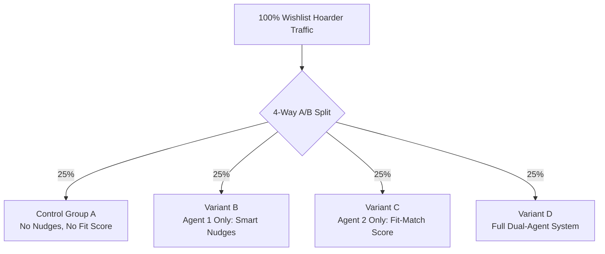

# 📊 Evaluation & Metrics Framework — Myntra Wishlist Conversion AI Agent (`eval.md`)

> **Project:** Myntra AI Agent — Dual-Agent System  
> **Scope:** Smart Nudge Agent (Timing) & Fit-Confidence Match Agent (Body Type / Style Fit)  
> **Purpose:** Define evaluation metrics, benchmarks, test suites, and A/B testing frameworks to validate agent performance, model accuracy, and business impact.

---

## 📋 Table of Contents

1. [Evaluation Philosophy](#1-evaluation-philosophy)
2. [Key Performance Indicators (KPI Hierarchy)](#2-key-performance-indicators-kpi-hierarchy)
3. [Agent 1 — Smart Nudge Agent Metrics](#3-agent-1--smart-nudge-agent-metrics)
4. [Agent 2 — Fit-Confidence Match Agent Metrics](#4-agent-2--fit-confidence-match-agent-metrics)
5. [System Performance & Latency Benchmarks](#5-system-performance--latency-benchmarks)
6. [Offline & Algorithmic Evaluation Datasets](#6-offline--algorithmic-evaluation-datasets)
7. [Online Evaluation & A/B Testing Framework](#7-online-evaluation--ab-testing-framework)
8. [Automated Test Suite & Guardrails](#8-automated-test-suite--guardrails)

---

## 1. Evaluation Philosophy

The evaluation strategy operates across three distinct tiers:

1. **System & Operational Metrics (Offline/Technical):** Ensures APIs meet latency SLAs, LLM extraction accuracy, and uptime targets.
2. **Algorithmic & Model Metrics (Offline/Accuracy):** Evaluates heuristic fit-scoring accuracy, salary-day clustering correctness, and push deduplication precision.
3. **Business & Impact Metrics (Online/Product):** Measures incremental conversion rate (CR), average order value (AOV), return rate reduction, and notification engagement.

---

## 2. Key Performance Indicators (KPI Hierarchy)

```
                       ┌──────────────────────────────────────────┐
                       │           NORTH STAR METRIC              │
                       │ Wishlist 30-Day Conversion Rate (10% → 18%)│
                       └────────────────────┬─────────────────────┘
                                            │
               ┌────────────────────────────┴───────────────────────────┐
               ▼                                                        ▼
┌──────────────────────────────┐                         ┌──────────────────────────────┐
│      AGENT 1 KPI (TIMING)    │                         │  AGENT 2 KPI (CONFIDENCE)    │
│  Nudge-Attributed Conversion │                         │  Fit-Match Score Engagement  │
│      & CTR (Target > 12%)    │                         │   & Return Rate Reduction    │
└──────────────┬───────────────┘                         └──────────────┬───────────────┘
               │                                                        │
 ┌─────────────┴─────────────┐                            ┌─────────────┴─────────────┐
 │ • Price Drop CTR          │                            │ • Profile Completion Rate │
 │ • Salary Nudge Timing Acc │                            │ • LLM Extraction Precision│
 │ • Opt-Out Rate (< 0.5%)   │                            │ • Fit-Score Conversion Lift│
 └───────────────────────────┘                            └───────────────────────────┘
```

---

## 3. Agent 1 — Smart Nudge Agent Metrics

### 3.1 Business & User Engagement Metrics

| Metric Name | Formula / Definition | Target | Monitoring Frequency |
|-------------|----------------------|--------|---------------------|
| **Nudge Click-Through Rate (CTR)** | `(Total Nudge Clicks / Total Nudges Delivered) * 100` | `≥ 12.0%` | Daily |
| **Nudge Conversion Rate (CVR)** | `(Purchases within 48h of Nudge / Nudge Clicks) * 100` | `≥ 15.0%` | Daily |
| **Nudge Opt-Out Rate** | `(Users Disabling Nudge Category / Total Nudge Recipients) * 100` | `< 0.5%` | Weekly |
| **Unsubscribe / Block Rate** | `(FCM Unregistrations / Total Sent Nudges) * 100` | `< 0.1%` | Daily |
| **Incremental Margin Lift** | Revenue generated via non-discounted timing nudges | `+8% vs control` | Monthly |

### 3.2 Algorithmic Accuracy & System Precision

| Metric Name | Description | Target |
|-------------|-------------|--------|
| **Salary Window Precision** | Ratio of salary nudges delivered during actual user purchase window | `≥ 85%` |
| **Price Drop Lead Lag** | Time difference between price update in DB and push delivery | `< 5 mins` |
| **Deduplication Enforcement** | Percent of potential double-nudges blocked within 48-hour window | `100%` |
| **Daily Cap Compliance** | Percent of users receiving strictly `≤ 3` nudges per 24 hours | `100%` |

---

## 4. Agent 2 — Fit-Confidence Match Agent Metrics

### 4.1 Business & Quality Metrics

| Metric Name | Formula / Definition | Target | Monitoring Frequency |
|-------------|----------------------|--------|---------------------|
| **Onboarding Completion Rate** | `(Users completing 4 steps / Onboarding views) * 100` | `≥ 65.0%` | Weekly |
| **High Match Score CVR** | Conversion rate for items scored `≥ 80%` | `≥ 22.0%` | Daily |
| **Fit-Related Return Rate Reduction** | Reduction in size/fit return reasons for high match orders | `-15.0%` | Monthly |
| **Wishlist Card Badge Coverage** | Percent of wishlisted apparel items displaying a valid score | `≥ 95.0%` | Daily |

### 4.2 LLM & Heuristic Extraction Accuracy

Evaluate Product Attribute Extraction performance against a human-annotated golden evaluation dataset (`N = 1,000` apparel items).

$$\text{Precision} = \frac{TP}{TP + FP}, \quad \text{Recall} = \frac{TP}{TP + FN}, \quad F_1 = 2 \times \frac{\text{Precision} \times \text{Recall}}{\text{Precision} + \text{Recall}}$$

| Metric Name | Evaluation Target | Benchmark |
|-------------|-------------------|-----------|
| **Attribute Extraction Precision** | Accuracy of extracted `silhouette`, `cut`, `fabric` from raw text | `≥ 92.0%` |
| **Attribute Extraction Recall** | Proportion of present product attributes correctly identified | `≥ 88.0%` |
| **LLM Output Schema Validity** | Percentage of LLM responses conforming strictly to Zod schema | `≥ 99.5%` |
| **Heuristic Score Calibration** | Correlation between predicted match band and actual user post-purchase satisfaction | `r ≥ 0.75` |

---

## 5. System Performance & Latency Benchmarks

| Component | Operation | p50 SLA | p95 SLA | p99 SLA |
|-----------|-----------|---------|---------|---------|
| **Agent 1** | Price Drop Trigger Evaluation | `< 50ms` | `< 150ms` | `< 300ms` |
| **Agent 1** | FCM Payload Queue Dispatch | `< 100ms` | `< 300ms` | `< 800ms` |
| **Agent 2** | Fit-Score Lookup (Cached in Redis) | `< 10ms` | `< 35ms` | `< 50ms` |
| **Agent 2** | Fit-Score Calculation (Cold/Heuristic) | `< 80ms` | `< 150ms` | `< 250ms` |
| **Agent 2** | Fit-Score Calculation (Cold + LLM Extraction) | `< 400ms` | `< 750ms` | `< 1200ms` |
| **API Gateway** | Unified Wishlist Enrichment | `< 120ms` | `< 200ms` | `< 450ms` |

---

## 6. Offline & Algorithmic Evaluation Datasets

To prevent regressions in model logic, two static benchmark datasets are maintained in the repository:

### 6.1 `golden_attribute_dataset.json`
* **Size:** 1,000 apparel product descriptions annotated by fashion domain experts.
* **Usage:** Evaluates Gemini LLM parser accuracy on `cut`, `fabric`, `silhouette`, `fit_type`, and `length`.
* **Automated CI Check:** `npm run test:eval:attributes` (fails if $F_1 < 0.90$).

### 6.2 `golden_fit_matrix.json`
* **Size:** 250 profile-item test pairs (e.g., Pear shape + A-line dress).
* **Usage:** Evaluates consistency and mathematical correctness of `ScoringEngine`.
* **Automated CI Check:** `npm run test:eval:scoring` (fails if expected score deviates by `> 2%`).

---

## 7. Online Evaluation & A/B Testing Framework

A 4-way A/B testing experiment layout is established to isolate the conversion impact of each agent:



### Experiment Metrics Matrix

| Variant | Hypothesis | Primary Outcome Metric |
|---------|------------|------------------------|
| **Control A** | Baseline behavior without interventions | Baseline 30-Day Conversion (~9.5%) |
| **Variant B (Agent 1)** | Timing nudges eliminate timing delay blockers | Target: 30-Day Conversion → **13.5%** |
| **Variant C (Agent 2)** | Fit-confidence scores eliminate hesitancy blockers | Target: 30-Day Conversion → **12.0%** |
| **Variant D (Combined)** | Resolving BOTH blockers creates compound conversion lift | Target: 30-Day Conversion → **18.0%** |

---

## 8. Automated Test Suite & Guardrails

### 8.1 CI/CD Evaluation Guardrail Script

```json
// Package.json script integration
"scripts": {
  "eval:all": "ts-node scripts/eval/runAllEvaluations.ts",
  "eval:llm-precision": "ts-node scripts/eval/evalLlmPrecision.ts",
  "eval:scoring-matrix": "ts-node scripts/eval/evalScoringMatrix.ts"
}
```

```typescript
// scripts/eval/evalScoringMatrix.ts snippet
import goldenMatrix from './golden_fit_matrix.json';
import { ScoringEngine } from '../../services/agent2-fit/src/scoring-engine/scoringEngine';

async function runScoringEvaluation() {
  let passed = 0;
  for (const testCase of goldenMatrix) {
    const result = ScoringEngine.score(testCase.profile, testCase.attributes);
    const diff = Math.abs(result.score - testCase.expectedScore);
    if (diff <= 2) {
      passed++;
    } else {
      console.error(`❌ Mismatch for ID ${testCase.id}: Expected ${testCase.expectedScore}, got ${result.score}`);
    }
  }
  const accuracy = (passed / goldenMatrix.length) * 100;
  console.log(`📊 Fit-Scoring Matrix Accuracy: ${accuracy.toFixed(2)}%`);
  if (accuracy < 98.0) {
    process.exit(1); // Fail CI pipeline
  }
}

runScoringEvaluation();
```

---

## 📐 Evaluation Dashboard Summary

| Component | Target Standard | Metric Type |
|-----------|-----------------|-------------|
| **North Star** | Wishlist Conversion **10% → 18%** | Product/Business |
| **Agent 1** | Nudge CTR `≥ 12%`, Opt-Out `< 0.5%` | Engagement |
| **Agent 2** | LLM Precision `≥ 92%`, Fit Return `-15%` | Model Accuracy |
| **System** | p95 Latency (Cached) `< 50ms` | Infrastructure |

---

*Evaluation Framework Specification version: 1.0 · Last updated: August 2026*
